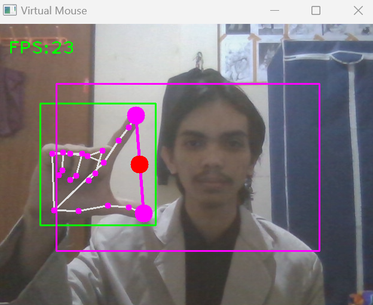

# Virtual Mouse

> A virtual mouse system using a webcam by implementing Hand Gesture Recognition and Hand Landmark Models using MediaPipe and OpenCV.

## Table of Contents

- [General Info](#general-information)
- [Technologies Used](#technologies-used)
- [Features](#features)
- [Screenshots](#screenshots)
- [Setup](#setup)
- [Project Status](#project-status)
- [Room for Improvement](#room-for-improvement)
- [Contact](#contact)

## General Information

- This project is my thesis research at Universitas Amikom Yogyakarta.
- Virtual mouse operates on videos using webcam with a machine learning (ML) model as static data or a continuous stream and outputs hand landmarks in image coordinates, hand landmarks in world coordinates and handedness(left/right hand) of multiple detected hands.
- This project aims to implement hand gesture recognition on a virtual mouse using the OpenCV library and mediapipe. Testing the virtual mouse system based on the level of low light intensity (50 lux) and bright light (120 lux) and a test distance of 0,5 - 3 ms.
- The results of this project are the level of accuracy of the system in low light, the average response speed of the system is 0,06 seconds with an accuracy rate of 81%. While testing the system in bright light, the average system response speed is 0,05 seconds with an accuracy rate of 98%.

## Technologies Used

- Python - version 3.8.x
- MediaPipe - version 0.10.1
- OpenCV - version 4.7.0

## Features

- Virtual mouse can controlling the mouse movement with real-time camera that detects hand landmarks, tracks gesture patterns instead of a physical mouse with an accuracy rate of 98%.

## Screenshots



## Installation

To setup the system for development on your local machine, please follow the instructions below:
1. Clone the repository to your machine
```bash
git clone https://github.com/Zulhaditya/virtual-mouse.git
```
2. Run **VirtualMouse.py** file.

## Project Status

Project is: _complete._ <!-- / _complete_ / _no longer being worked on_. reason ? -->

## Room for Improvement

- Add function to detect multiple hands
- Add some functionality such as adjusting the volume and screen brightness

## Acknowledgements

- This project was inspired by the [MediaPipe](https://developers.google.com/mediapipe/) documentation on the official website.

## Contact

Created by [@Zulhaditya](https://zulhaditya.vercel.app) - feel free to contact me!
